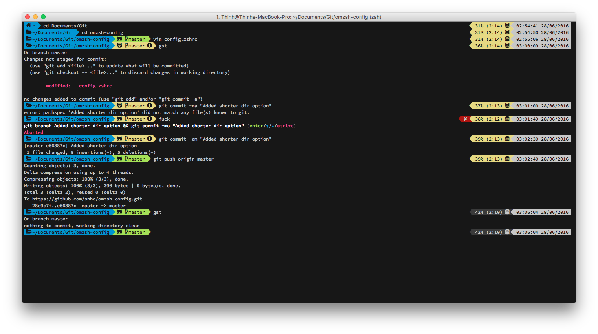

# oh-my-zsh config

The following are instructions on how to configure iTerm and oh-my-zsh + zsh to replicate the terminal below. 

### Prerequisites

- [iTerm 2](http://iterm2.com)
- Patched font for Powerline + fontawesome (SourceCodePro provided in repo).

**Recommended**: Setting up a visor view and global hotkey is really awesome with iTerm 2! [Instructions here.](http://apple.stackexchange.com/questions/48796/iterm-as-a-slide-out-terminal-from-the-top-of-the-screen)

### Instructions

1. Install the font onto your machine if you have not done so, and set it as the font of choice in iTerm 2.
2. [Install zsh + oh-my-zsh](https://github.com/robbyrussell/oh-my-zsh#getting-started)
3. [Download powerlevel9k theme (Option 2)](https://github.com/bhilburn/powerlevel9k/wiki/Install-Instructions#option-2-install-for-oh-my-zsh)
3. Configure theme - add the config supplied to the generated config.zshrc

**Optionional**: Configure oh-my-zsh with the plugins that you might use.

### Other Information
- Colour scheme used for the screenshot is Molokai.
- Some explicit references to ANSI 256 colour codes were used to set the colour of some elements, so it might not fit in correctly with your preferred colour scheme. [Use this as a reference for colours.](https://upload.wikimedia.org/wikipedia/en/1/15/Xterm_256color_chart.svg)